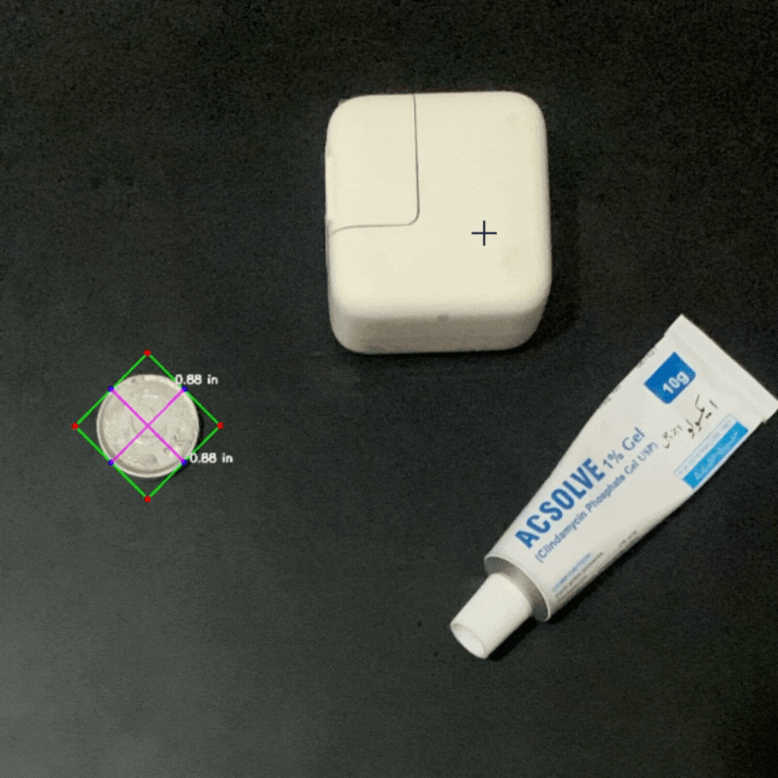

# 📏 Object Size Estimation Using OpenCV

Estimate the real-world dimensions of objects in an image using OpenCV, with the help of a known reference object.

---

## 🧠 Overview

This project calculates the **physical dimensions** of objects in an image by:

- Detecting contours
- Using a known reference object to calculate a **Pixels-Per-Metric (PPM)** ratio
- Converting pixel measurements into real-world units (inches, cm, meters, etc.)

## ⚙️ How It Works

1. **Contour Detection** – Identifies all objects using edge detection.
2. **Bounding Boxes** – Fits minimum-area rectangles around each contour.
3. **Midpoint Calculation** – Computes midpoints between rectangle edges for measurement.
4. **Reference Scaling** – Uses a known-size object (e.g., coin) to calculate PPM.
5. **Measurement Annotation** – Outputs and annotates width/height in your chosen unit.

## 🧾 Assumptions

- A **clearly visible** reference object is in the image.
- The **real-world dimension** (width/height) of the reference is known.
- The image is taken from a **near top-down perspective** (minimal distortion).
- The reference object is **distinct and detectable** (e.g., shape, position).


## 🪙 Reference Object


- Its diameter is Known.
- Acts as a real-world scale for measurement


## 📦 Requirements

- Python ≥ 3.7.3  
- OpenCV ≥ 4.1.0  
- NumPy ≥ 1.16.4  
- imutils ≥ 0.5.2  

### Install Dependencies:

```bash
pip install opencv-python numpy imutils

```
## ✅ Output

- Bounding boxes drawn around each object  
- Width and height annotated in selected units  
- Image is saved or displayed with measurements  


---
## ⚠️ Limitations

- Works best with **top-down images**
- **Lens distortion** can impact accuracy
- Accuracy depends on **clear visibility** of the reference object
- For high-accuracy: consider **camera calibration**


## 📌 To-Do / Improvements

- Add camera calibration support
- Add GUI or web interface
- Support for automatic reference object detection
- Improve robustness for angled images


## 🧪 Example Usage

### Command:

```bash
python object_size.py --image <path_to_image> --width <reference_width> --unit <unit>
```

### Examples:

```bash
python object_size.py --image images/test_01.png --width 0.955 --unit inches
python object_size.py --image images/test_02.png --width 0.955 --unit cm
python object_size.py --image images/test_02.png --width 0.955 --unit meters

---


